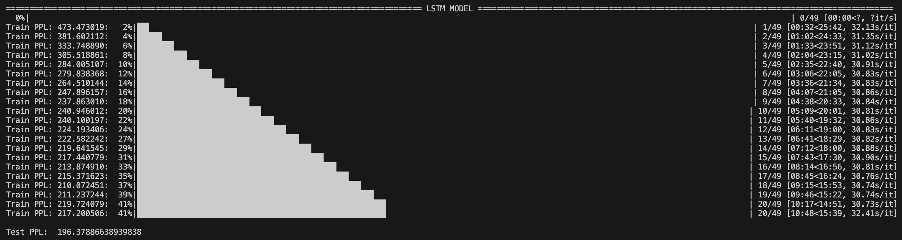
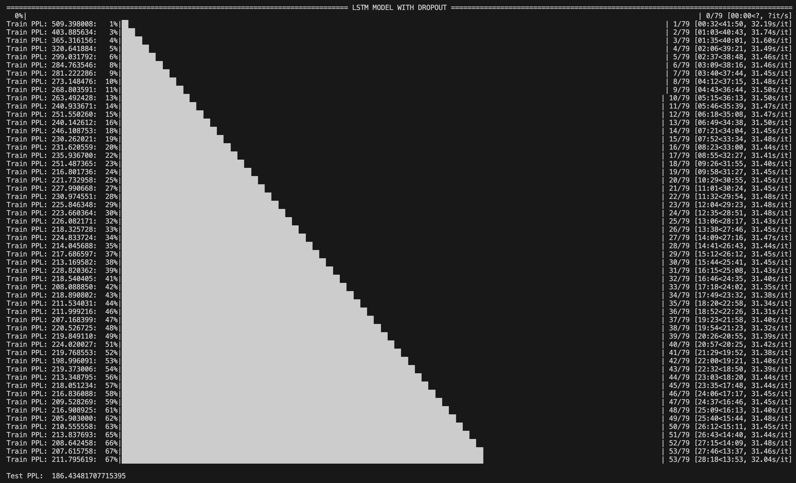
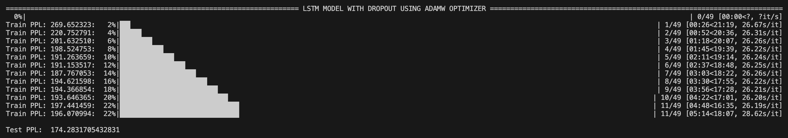

# EXPERIMENTS and RESULTS

## LSTM
- 1st test: `Test PPL:  233.77336157935472`
  - TRAIN_BATCH_SIZE = 256
  - VALID_BATCH_SIZE = 512
  - TEST_BATCH_SIZE = 512
  - EMBEDDING_SIZE = 600
  - HIDDEN_SIZE = 800
  - LEARNING_RATE = 0.5
  - PATIENCE = 4
  - CLIP = 5

- 2nd test: `Test PPL:  253.00521613850397`
  - TRAIN_BATCH_SIZE = 256
  - VALID_BATCH_SIZE = 512
  - TEST_BATCH_SIZE = 512
  - EMBEDDING_SIZE = 800
  - HIDDEN_SIZE = 800
  - LEARNING_RATE = 0.3
  - PATIENCE = 3
  - CLIP = 5

- 3rd test: `Test PPL:  236.3260015487709`
  - TRAIN_BATCH_SIZE = 256
  - VALID_BATCH_SIZE = 512
  - TEST_BATCH_SIZE = 512
  - EMBEDDING_SIZE = 800
  - HIDDEN_SIZE = 1000
  - LEARNING_RATE = 0.5
  - PATIENCE = 3
  - CLIP = 10

- 4th tes: `Test PPL:  251.69983052227623`
  - TRAIN_BATCH_SIZE = 256
  - VALID_BATCH_SIZE = 512
  - TEST_BATCH_SIZE = 512
  - EMBEDDING_SIZE = 400
  - HIDDEN_SIZE = 600
  - LEARNING_RATE = 0.5
  - PATIENCE = 3
  - CLIP = 10

- 5th test: `Test PPL:  271.00899632445001`
  - TRAIN_BATCH_SIZE = 512
  - VALID_BATCH_SIZE = 1024
  - TEST_BATCH_SIZE = 1024
  - EMBEDDING_SIZE = 800
  - HIDDEN_SIZE = 800
  - LEARNING_RATE = 0.5
  - PATIENCE = 5
  - CLIP = 10

- 6th test: `Test PPL:  201.17399936143755`
  - TRAIN_BATCH_SIZE = 128
  - VALID_BATCH_SIZE = 512
  - TEST_BATCH_SIZE = 512
  - EMBEDDING_SIZE = 600
  - HIDDEN_SIZE = 800
  - LEARNING_RATE = 0.5
  - PATIENCE = 5
  - CLIP = 10

- BEST TEST: `Test PPL:  196.37886638939838` ✅
  - TRAIN_BATCH_SIZE = 128
  - VALID_BATCH_SIZE = 512
  - TEST_BATCH_SIZE = 512
  - EMBEDDING_SIZE = 800
  - HIDDEN_SIZE = 1000
  - LEARNING_RATE = 0.5
  - PATIENCE = 5
  - CLIP = 10

## LSTM + dropout
- 1st test: `Test PPL:  380.2289912256579`
  - TRAIN_BATCH_SIZE = 256
  - VALID_BATCH_SIZE = 512
  - TEST_BATCH_SIZE = 512
  - EMBEDDING_SIZE = 400
  - HIDDEN_SIZE = 600
  - LEARNING_RATE = 0.3
  - PATIENCE = 3
  - CLIP = 5

- 2nd test: `Test PPL:  313.8431553267222`
  - TRAIN_BATCH_SIZE = 256
  - VALID_BATCH_SIZE = 512
  - TEST_BATCH_SIZE = 512
  - EMBEDDING_SIZE = 800
  - HIDDEN_SIZE = 1000
  - LEARNING_RATE = 0.5
  - PATIENCE = 3
  - CLIP = 10

- 3rd test: `Test PPL:  341.7454054775944`
  - TRAIN_BATCH_SIZE = 256
  - VALID_BATCH_SIZE = 1024
  - TEST_BATCH_SIZE = 1024
  - EMBEDDING_SIZE = 600
  - HIDDEN_SIZE = 800
  - LEARNING_RATE = 0.3
  - PATIENCE = 3
  - CLIP = 5

- 4th tes: `Test PPL:  264.84290249616345`
  - TRAIN_BATCH_SIZE = 128
  - VALID_BATCH_SIZE = 512
  - TEST_BATCH_SIZE = 512
  - EMBEDDING_SIZE = 600
  - HIDDEN_SIZE = 800
  - LEARNING_RATE = 0.5
  - PATIENCE = 3
  - CLIP = 10

- 5th test: `Test PPL:  238.97093551970562`
  - TRAIN_BATCH_SIZE = 64
  - VALID_BATCH_SIZE = 256
  - TEST_BATCH_SIZE = 256
  - EMBEDDING_SIZE = 800
  - HIDDEN_SIZE = 1000
  - LEARNING_RATE = 0.5
  - PATIENCE = 3
  - CLIP = 5

- 6th test: `Test PPL:  247.70503289492905`
  - TRAIN_BATCH_SIZE = 64
  - VALID_BATCH_SIZE = 256
  - TEST_BATCH_SIZE = 256
  - EMBEDDING_SIZE = 600
  - HIDDEN_SIZE = 800
  - LEARNING_RATE = 0.5
  - PATIENCE = 3
  - CLIP = 10

- 7th test: `Test PPL:  230.00684261953364`
  - TRAIN_BATCH_SIZE = 64
  - VALID_BATCH_SIZE = 256
  - TEST_BATCH_SIZE = 256
  - EMBEDDING_SIZE = 800
  - HIDDEN_SIZE = 1000
  - LEARNING_RATE = 0.5
  - PATIENCE = 3
  - CLIP = 5

- 8th test: `Test PPL:  242.15879441682276`
  - TRAIN_BATCH_SIZE = 64
  - VALID_BATCH_SIZE = 512
  - TEST_BATCH_SIZE = 512
  - EMBEDDING_SIZE = 800
  - HIDDEN_SIZE = 1000
  - LEARNING_RATE = 0.5
  - PATIENCE = 3
  - CLIP = 10

- 9th test: `Test PPL:  237.91017544848873`
  - TRAIN_BATCH_SIZE = 64
  - VALID_BATCH_SIZE = 256
  - TEST_BATCH_SIZE = 256
  - EMBEDDING_SIZE = 600
  - HIDDEN_SIZE = 800
  - LEARNING_RATE = 0.5
  - PATIENCE = 3
  - CLIP = 5

- BEST TEST: `Test PPL:  186.43481707715395` ✅ 
  - TRAIN_BATCH_SIZE = 128
  - VALID_BATCH_SIZE = 512
  - TEST_BATCH_SIZE = 512
  - EMBEDDING_SIZE = 800
  - HIDDEN_SIZE = 1000
  - LEARNING_RATE = 0.5
  - PATIENCE = 10
  - CLIP = 10
  - 

## LSTM + dropout + AdamW
- 1st test: `Test PPL:  216.50223906405762`
  - TRAIN_BATCH_SIZE = 128
  - VALID_BATCH_SIZE = 512
  - TEST_BATCH_SIZE = 512
  - EMBEDDING_SIZE = 600
  - HIDDEN_SIZE = 800
  - LEARNING_RATE = 0.05
  - WEIGHT_DECAY = 0.01
  - EPSILON = 1e-6
  - PATIENCE = 5
  - CLIP = 10

- 2nd test: `Test PPL:  194.81697694668503`
  - TRAIN_BATCH_SIZE = 128
  - VALID_BATCH_SIZE = 512
  - TEST_BATCH_SIZE = 512
  - EMBEDDING_SIZE = 800
  - HIDDEN_SIZE = 1000
  - LEARNING_RATE = 0.01
  - WEIGHT_DECAY = 0.01
  - EPSILON = 1e-6
  - PATIENCE = 5
  - CLIP = 10

- 3rd test: `Test PPL:  192.63185027227888`
  - TRAIN_BATCH_SIZE = 128
  - VALID_BATCH_SIZE = 512
  - TEST_BATCH_SIZE = 512
  - EMBEDDING_SIZE = 600
  - HIDDEN_SIZE = 800
  - LEARNING_RATE = 0.01
  - WEIGHT_DECAY = 0.01
  - EPSILON = 1e-6
  - PATIENCE = 5
  - CLIP = 10

- 4th test: `Test PPL:  176.52243381795674`
  - TRAIN_BATCH_SIZE = 128
  - VALID_BATCH_SIZE = 512
  - TEST_BATCH_SIZE = 512
  - EMBEDDING_SIZE = 600
  - HIDDEN_SIZE = 800
  - LEARNING_RATE = 0.001
  - WEIGHT_DECAY = 0.01
  - EPSILON = 1e-6
  - PATIENCE = 5
  - CLIP = 5

- 5th test: `Test PPL:  181.5375286953544`
  - TRAIN_BATCH_SIZE = 128
  - VALID_BATCH_SIZE = 512
  - TEST_BATCH_SIZE = 512
  - EMBEDDING_SIZE = 600
  - HIDDEN_SIZE = 800
  - LEARNING_RATE = 0.001
  - WEIGHT_DECAY = 0.01
  - EPSILON = 1e-5
  - PATIENCE = 5
  - CLIP = 10

- 6th test: `Test PPL:  254.27531961074732`
  - TRAIN_BATCH_SIZE = 128
  - VALID_BATCH_SIZE = 512
  - TEST_BATCH_SIZE = 512
  - EMBEDDING_SIZE = 600
  - HIDDEN_SIZE = 800
  - LEARNING_RATE = 0.0001
  - WEIGHT_DECAY = 0.01
  - EPSILON = 1e-6
  - PATIENCE = 5
  - CLIP = 5

- 7th test: `Test PPL:  175.87144444054283`
  - TRAIN_BATCH_SIZE = 128
  - VALID_BATCH_SIZE = 512
  - TEST_BATCH_SIZE = 512
  - EMBEDDING_SIZE = 600
  - HIDDEN_SIZE = 800
  - LEARNING_RATE = 0.001
  - WEIGHT_DECAY = 0.001
  - EPSILON = 1e-6
  - PATIENCE = 5
  - CLIP = 5

- 8th test: `Test PPL:  175.5547175391782`
  - TRAIN_BATCH_SIZE = 128
  - VALID_BATCH_SIZE = 512
  - TEST_BATCH_SIZE = 512
  - EMBEDDING_SIZE = 600
  - HIDDEN_SIZE = 800
  - LEARNING_RATE = 0.001
  - WEIGHT_DECAY = 0.001
  - EPSILON = 1e-7
  - PATIENCE = 5
  - CLIP = 5

- BEST TEST: `Test PPL:  174.2831705432831` ✅
  - TRAIN_BATCH_SIZE = 128
  - VALID_BATCH_SIZE = 512
  - TEST_BATCH_SIZE = 512
  - EMBEDDING_SIZE = 600
  - HIDDEN_SIZE = 800
  - LEARNING_RATE = 0.001
  - WEIGHT_DECAY = 0.01
  - EPSILON = 1e-7
  - PATIENCE = 5
  - CLIP = 10

