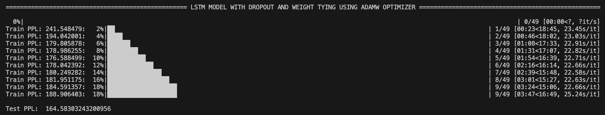
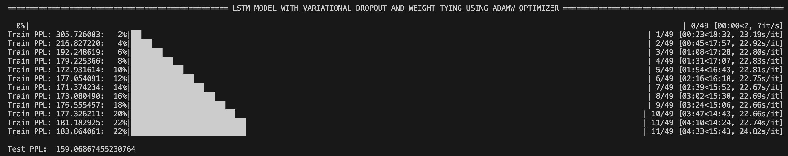
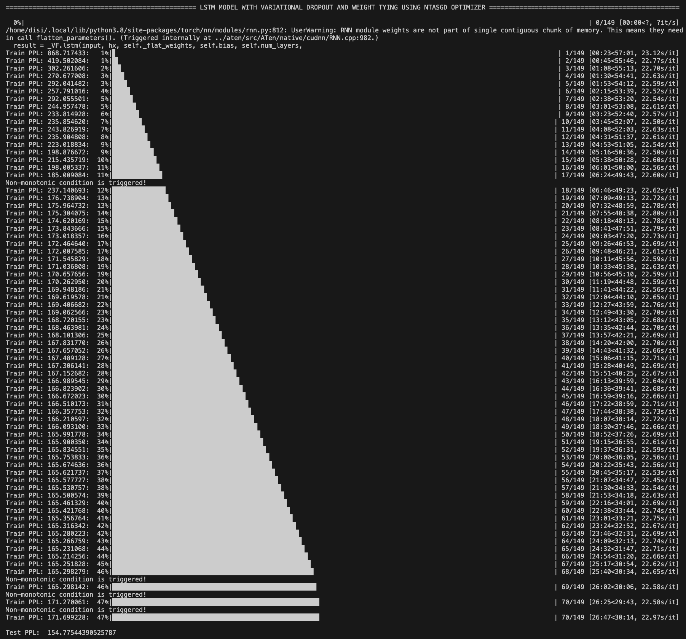

# EXPERIMENTS and RESULTS

## Weight Tying
- 1st test: `Test PPL:  191.39783756510815`
  - TRAIN_BATCH_SIZE = 128
  - VALID_BATCH_SIZE = 512
  - TEST_BATCH_SIZE = 512
  - EMBEDDING_SIZE = 600
  - HIDDEN_SIZE = 800
  - LEARNING_RATE = 0.001
  - WEIGHT_DECAY = 0.01
  - EPSILON = 1e-7
  - PATIENCE = 5
  - CLIP = 5

- 2nd test: `Test PPL:  173.19187455160525`
  - TRAIN_BATCH_SIZE = 128
  - VALID_BATCH_SIZE = 512
  - TEST_BATCH_SIZE = 512
  - EMBEDDING_SIZE = 600
  - HIDDEN_SIZE = 800
  - LEARNING_RATE = 0.01
  - WEIGHT_DECAY = 0.01
  - EPSILON = 1e-7
  - PATIENCE = 5
  - CLIP = 5

- 3rd test: `Test PPL:  177.93231109379957`
  - TRAIN_BATCH_SIZE = 128
  - VALID_BATCH_SIZE = 512
  - TEST_BATCH_SIZE = 512
  - EMBEDDING_SIZE = 600
  - HIDDEN_SIZE = 800
  - LEARNING_RATE = 0.005
  - WEIGHT_DECAY = 0.01
  - EPSILON = 1e-7
  - PATIENCE = 5
  - CLIP = 5

- 4th test:` Test PPL:  235.36749087737218`
  - TRAIN_BATCH_SIZE = 128
  - VALID_BATCH_SIZE = 512
  - TEST_BATCH_SIZE = 512
  - EMBEDDING_SIZE = 600
  - HIDDEN_SIZE = 800
  - LEARNING_RATE = 0.05
  - WEIGHT_DECAY = 0.01
  - EPSILON = 1e-6
  - PATIENCE = 5
  - CLIP = 5

- 5th test: `Test PPL:  171.90269360982467`
  - TRAIN_BATCH_SIZE = 128
  - VALID_BATCH_SIZE = 512
  - TEST_BATCH_SIZE = 512
  - EMBEDDING_SIZE = 600
  - HIDDEN_SIZE = 800
  - LEARNING_RATE = 0.01
  - WEIGHT_DECAY = 0.01
  - EPSILON = 1e-6
  - PATIENCE = 5
  - CLIP = 5

- 6th test: `Test PPL:  172.43467506109798`
  - TRAIN_BATCH_SIZE = 128
  - VALID_BATCH_SIZE = 512
  - TEST_BATCH_SIZE = 512
  - EMBEDDING_SIZE = 600
  - HIDDEN_SIZE = 800
  - LEARNING_RATE = 0.01
  - WEIGHT_DECAY = 0.001
  - EPSILON = 1e-6
  - PATIENCE = 5
  - CLIP = 5

- 7th test: `Test PPL:  175.17038190493528`
  - TRAIN_BATCH_SIZE = 128
  - VALID_BATCH_SIZE = 512
  - TEST_BATCH_SIZE = 512
  - EMBEDDING_SIZE = 800
  - HIDDEN_SIZE = 800
  - LEARNING_RATE = 0.01
  - WEIGHT_DECAY = 0.001
  - EPSILON = 1e-6
  - PATIENCE = 5
  - CLIP = 5

- 8th test: `Test PPL:  174.47841227924638`
  - TRAIN_BATCH_SIZE = 128
  - VALID_BATCH_SIZE = 512
  - TEST_BATCH_SIZE = 512
  - EMBEDDING_SIZE = 700
  - HIDDEN_SIZE = 800
  - LEARNING_RATE = 0.01
  - WEIGHT_DECAY = 0.001
  - EPSILON = 1e-6
  - PATIENCE = 5
  - CLIP = 5

- 9th test: `Test PPL:  173.82831472066647`
  - TRAIN_BATCH_SIZE = 128
  - VALID_BATCH_SIZE = 512
  - TEST_BATCH_SIZE = 512
  - EMBEDDING_SIZE = 500
  - HIDDEN_SIZE = 800
  - LEARNING_RATE = 0.01
  - WEIGHT_DECAY = 0.001
  - EPSILON = 1e-6
  - PATIENCE = 5
  - CLIP = 5

- BEST TEST: `Test PPL:  164.58303243200956` ✅
  - TRAIN_BATCH_SIZE = 256
  - VALID_BATCH_SIZE = 512
  - TEST_BATCH_SIZE = 512
  - EMBEDDING_SIZE = 600
  - HIDDEN_SIZE = 800
  - LEARNING_RATE = 0.01
  - WEIGHT_DECAY = 0.01
  - EPSILON = 1e-7
  - PATIENCE = 5
  - CLIP = 5

## Weight Tying + Variational dropout
- 1st test: `Test PPL:  163.93880758512532`
  - TRAIN_BATCH_SIZE = 256
  - VALID_BATCH_SIZE = 512
  - TEST_BATCH_SIZE = 512
  - EMBEDDING_SIZE = 600
  - HIDDEN_SIZE = 800
  - LEARNING_RATE = 0.01
  - WEIGHT_DECAY = 0.01
  - EPSILON = 1e-7
  - PATIENCE = 5
  - CLIP = 5

- 2nd test: `Test PPL:  175.02943176959704`
  - TRAIN_BATCH_SIZE = 128
  - VALID_BATCH_SIZE = 512
  - TEST_BATCH_SIZE = 512
  - EMBEDDING_SIZE = 600
  - HIDDEN_SIZE = 800
  - LEARNING_RATE = 0.01
  - WEIGHT_DECAY = 0.01
  - EPSILON = 1e-7
  - PATIENCE = 5
  - CLIP = 5

- 3rd test: `Test PPL:  166.70887203301382`
  - TRAIN_BATCH_SIZE = 256
  - VALID_BATCH_SIZE = 512
  - TEST_BATCH_SIZE = 512
  - EMBEDDING_SIZE = 700
  - HIDDEN_SIZE = 800
  - LEARNING_RATE = 0.01
  - WEIGHT_DECAY = 0.01
  - EPSILON = 1e-7
  - PATIENCE = 5
  - CLIP = 5

- 4th test: `Test PPL:  218.4924363452828`
  - TRAIN_BATCH_SIZE = 256
  - VALID_BATCH_SIZE = 512
  - TEST_BATCH_SIZE = 512
  - EMBEDDING_SIZE = 600
  - HIDDEN_SIZE = 800
  - LEARNING_RATE = 0.05
  - WEIGHT_DECAY = 0.01
  - EPSILON = 1e-7
  - PATIENCE = 5
  - CLIP = 5

- 5th test: `Test PPL:  159.53060073642365`
  - TRAIN_BATCH_SIZE = 256
  - VALID_BATCH_SIZE = 512
  - TEST_BATCH_SIZE = 512
  - EMBEDDING_SIZE = 600
  - HIDDEN_SIZE = 800
  - LEARNING_RATE = 0.005
  - WEIGHT_DECAY = 0.01
  - EPSILON = 1e-8
  - PATIENCE = 5
  - CLIP = 5

- 6th test: `Test PPL:  198.92491908320855`
  - TRAIN_BATCH_SIZE = 256
  - VALID_BATCH_SIZE = 512
  - TEST_BATCH_SIZE = 512
  - EMBEDDING_SIZE = 600
  - HIDDEN_SIZE = 800
  - LEARNING_RATE = 0.001
  - WEIGHT_DECAY = 0.01
  - EPSILON = 1e-7
  - PATIENCE = 5
  - CLIP = 5

- 7th test: `Test PPL:  160.02023390840858`
  - TRAIN_BATCH_SIZE = 256
  - VALID_BATCH_SIZE = 512
  - TEST_BATCH_SIZE = 512
  - EMBEDDING_SIZE = 600
  - HIDDEN_SIZE = 800
  - LEARNING_RATE = 0.005
  - WEIGHT_DECAY = 0.01
  - EPSILON = 1e-6
  - PATIENCE = 5
  - CLIP = 5

- 8th test: `Test PPL:  159.25151775748446`
  - TRAIN_BATCH_SIZE = 256
  - VALID_BATCH_SIZE = 512
  - TEST_BATCH_SIZE = 512
  - EMBEDDING_SIZE = 600
  - HIDDEN_SIZE = 800
  - LEARNING_RATE = 0.005
  - WEIGHT_DECAY = 0.001
  - EPSILON = 1e-8
  - PATIENCE = 5
  - CLIP = 5

- BEST TEST: `Test PPL:  159.06867455230764` ✅
  - TRAIN_BATCH_SIZE = 256
  - VALID_BATCH_SIZE = 512
  - TEST_BATCH_SIZE = 512
  - EMBEDDING_SIZE = 600
  - HIDDEN_SIZE = 800
  - LEARNING_RATE = 0.005
  - WEIGHT_DECAY = 0.01
  - EPSILON = 1e-7
  - PATIENCE = 5
  - CLIP = 5

## Weight Tying + Variational dropout + Non-monotonically Triggered AvSGD
- 1st test: `Test PPL:  336.4728672829164`
  - TRAIN_BATCH_SIZE = 256
  - VALID_BATCH_SIZE = 512
  - TEST_BATCH_SIZE = 512
  - EMBEDDING_SIZE = 600
  - HIDDEN_SIZE = 800
  - LEARNING_RATE = 1
  - PATIENCE = 5
  - BPTT = 70
  - CLIP = 5

- 2nd test: `Test PPL:  266.5133995205174`
  - TRAIN_BATCH_SIZE = 256
  - VALID_BATCH_SIZE = 512
  - TEST_BATCH_SIZE = 512
  - EMBEDDING_SIZE = 600
  - HIDDEN_SIZE = 800
  - LEARNING_RATE = 5
  - PATIENCE = 5
  - BPTT = 70
  - CLIP = 5

- 3rd test: `Test PPL:  229.29337951744094`
  - TRAIN_BATCH_SIZE = 256
  - VALID_BATCH_SIZE = 512
  - TEST_BATCH_SIZE = 512
  - EMBEDDING_SIZE = 600
  - HIDDEN_SIZE = 800
  - LEARNING_RATE = 10
  - PATIENCE = 5
  - BPTT = 70
  - CLIP = 5

- 4th test: `Test PPL:  213.23482070281298`
  - TRAIN_BATCH_SIZE = 256
  - VALID_BATCH_SIZE = 512
  - TEST_BATCH_SIZE = 512
  - EMBEDDING_SIZE = 600
  - HIDDEN_SIZE = 800
  - LEARNING_RATE = 13
  - PATIENCE = 5
  - BPTT = 70
  - CLIP = 5

- 5th test: `Test PPL:  233.2898153404073`
  - TRAIN_BATCH_SIZE = 256
  - VALID_BATCH_SIZE = 512
  - TEST_BATCH_SIZE = 512
  - EMBEDDING_SIZE = 600
  - HIDDEN_SIZE = 800
  - LEARNING_RATE = 15
  - PATIENCE = 5
  - BPTT = 70
  - CLIP = 5

- 6th test: `Test PPL:  216.42963326351398`
  - TRAIN_BATCH_SIZE = 256
  - VALID_BATCH_SIZE = 512
  - TEST_BATCH_SIZE = 512
  - EMBEDDING_SIZE = 600
  - HIDDEN_SIZE = 800
  - LEARNING_RATE = 18
  - PATIENCE = 5
  - BPTT = 70
  - CLIP = 5
  
- 7th test: `Test PPL:  215.07194361854673`
  - TRAIN_BATCH_SIZE = 256
  - VALID_BATCH_SIZE = 512
  - TEST_BATCH_SIZE = 512
  - EMBEDDING_SIZE = 600
  - HIDDEN_SIZE = 800
  - LEARNING_RATE = 20
  - PATIENCE = 5
  - BPTT = 70
  - CLIP = 5

- 8th test: `Test PPL:  224.08662791159713`
  - TRAIN_BATCH_SIZE = 256
  - VALID_BATCH_SIZE = 512
  - TEST_BATCH_SIZE = 512
  - EMBEDDING_SIZE = 600
  - HIDDEN_SIZE = 800
  - LEARNING_RATE = 23
  - PATIENCE = 5
  - BPTT = 70
  - CLIP = 5

- 9th test: `Test PPL:  185.13727985618786`
  - TRAIN_BATCH_SIZE = 128
  - VALID_BATCH_SIZE = 512
  - TEST_BATCH_SIZE = 512
  - EMBEDDING_SIZE = 600
  - HIDDEN_SIZE = 800
  - LEARNING_RATE = 25
  - PATIENCE = 5
  - BPTT = 70
  - CLIP = 5

- 10th test: `Test PPL:  177.38290250613363`
  - TRAIN_BATCH_SIZE = 64
  - VALID_BATCH_SIZE = 512
  - TEST_BATCH_SIZE = 512
  - EMBEDDING_SIZE = 600
  - HIDDEN_SIZE = 800
  - LEARNING_RATE = 30
  - PATIENCE = 5
  - BPTT = 70
  - CLIP = 5

- 11th test: `Test PPL:  180.98044788505084`
  - TRAIN_BATCH_SIZE = 128
  - VALID_BATCH_SIZE = 512
  - TEST_BATCH_SIZE = 512
  - EMBEDDING_SIZE = 800
  - HIDDEN_SIZE = 800
  - LEARNING_RATE = 35
  - PATIENCE = 5
  - BPTT = 70
  - CLIP = 5

- 12th test: `Test PPL:  183.37017246371616`
  - TRAIN_BATCH_SIZE = 128
  - VALID_BATCH_SIZE = 512
  - TEST_BATCH_SIZE = 512
  - EMBEDDING_SIZE = 1000
  - HIDDEN_SIZE = 800
  - LEARNING_RATE = 33
  - PATIENCE = 5
  - BPTT = 70
  - CLIP = 5

- 13th test: `Test PPL:  200.842987033174`
  - TRAIN_BATCH_SIZE = 64
  - VALID_BATCH_SIZE = 512
  - TEST_BATCH_SIZE = 512
  - EMBEDDING_SIZE = 800
  - HIDDEN_SIZE = 800
  - LEARNING_RATE = 30
  - PATIENCE = 5
  - BPTT = 70
  - CLIP = 10

- 14th test: `Test PPL:  192.53694113912027`
  - TRAIN_BATCH_SIZE = 64
  - VALID_BATCH_SIZE = 512
  - TEST_BATCH_SIZE = 512
  - EMBEDDING_SIZE = 800
  - HIDDEN_SIZE = 800
  - LEARNING_RATE = 30
  - PATIENCE = 5
  - BPTT = 70
  - CLIP = 5

- 15th test: `Test PPL:  169.2245898638938`
  - TRAIN_BATCH_SIZE = 128
  - VALID_BATCH_SIZE = 512
  - TEST_BATCH_SIZE = 512
  - EMBEDDING_SIZE = 800
  - HIDDEN_SIZE = 800
  - LEARNING_RATE = 30
  - PATIENCE = 5
  - BPTT = 70
  - CLIP = 5

- BEST TEST: `Test PPL:  154.77544390525787` ✅
  - TRAIN_BATCH_SIZE = 256
  - VALID_BATCH_SIZE = 512
  - TEST_BATCH_SIZE = 512
  - EMBEDDING_SIZE = 600
  - HIDDEN_SIZE = 800
  - LEARNING_RATE = 30
  - PATIENCE = 5
  - BPTT = 70
  - CLIP = 5

