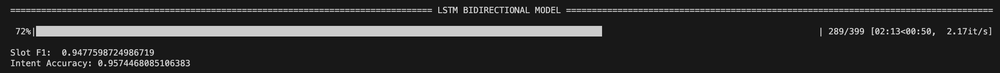
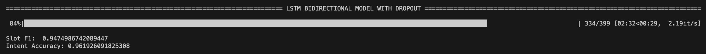

# EXPERIMENTS and RESULTS

## Model IAS + bidirectionality
- 1st test: `Slot F1:  0.7927372387804043` - `Intent Accuracy: 0.8006718924972005`
  - TRAIN_BATCH_SIZE = 128
  - VALID_BATCH_SIZE = 64
  - TEST_BATCH_SIZE = 64
  - EMBEDDING_SIZE = 300
  - HIDDEN_SIZE = 200
  - LEARNING_RATE = 0.1

- 2nd test: `Slot F1:  0.903214535290007` - `Intent Accuracy: 0.8980963045912654`
  - TRAIN_BATCH_SIZE = 128
  - VALID_BATCH_SIZE = 64
  - TEST_BATCH_SIZE = 64
  - EMBEDDING_SIZE = 300
  - HIDDEN_SIZE = 200
  - LEARNING_RATE = 0.05

- 3rd test: `Slot F1:  0.9432499118787452` - `Intent Accuracy: 0.9395296752519597`
  - TRAIN_BATCH_SIZE = 128
  - VALID_BATCH_SIZE = 64
  - TEST_BATCH_SIZE = 64
  - EMBEDDING_SIZE = 300
  - HIDDEN_SIZE = 200
  - LEARNING_RATE = 0.01

- 4th test: `Slot F1:  0.9489616332277366` - `Intent Accuracy: 0.9507278835386338`
  - TRAIN_BATCH_SIZE = 128
  - VALID_BATCH_SIZE = 64
  - TEST_BATCH_SIZE = 64
  - EMBEDDING_SIZE = 300
  - HIDDEN_SIZE = 200
  - LEARNING_RATE = 0.005

- 5th test: `Slot F1:  0.9427000177399327` - `Intent Accuracy: 0.9507278835386338`
  - TRAIN_BATCH_SIZE = 128
  - VALID_BATCH_SIZE = 64
  - TEST_BATCH_SIZE = 64
  - EMBEDDING_SIZE = 300
  - HIDDEN_SIZE = 200
  - LEARNING_RATE = 0.0005

- 6th test: `Slot F1:  0.9413417632595714` - `Intent Accuracy: 0.9518477043673013`
  - TRAIN_BATCH_SIZE = 128
  - VALID_BATCH_SIZE = 64
  - TEST_BATCH_SIZE = 64
  - EMBEDDING_SIZE = 300
  - HIDDEN_SIZE = 200
  - LEARNING_RATE = 0.0001

- 7th test: `Slot F1:  0.9475167312433956` - `Intent Accuracy: 0.9552071668533034`
  - TRAIN_BATCH_SIZE = 256
  - VALID_BATCH_SIZE = 64
  - TEST_BATCH_SIZE = 64
  - EMBEDDING_SIZE = 300
  - HIDDEN_SIZE = 200
  - LEARNING_RATE = 0.001

- 8th test: `Slot F1:  0.9432437181514672` - `Intent Accuracy: 0.9496080627099664`
  - TRAIN_BATCH_SIZE = 64
  - VALID_BATCH_SIZE = 64
  - TEST_BATCH_SIZE = 64
  - EMBEDDING_SIZE = 300
  - HIDDEN_SIZE = 200
  - LEARNING_RATE = 0.001

- BEST TEST: `Slot F1:  0.9477598724986719` - `Intent Accuracy: 0.9574468085106383` ✅
  - TRAIN_BATCH_SIZE = 128
  - VALID_BATCH_SIZE = 64
  - TEST_BATCH_SIZE = 64
  - EMBEDDING_SIZE = 300
  - HIDDEN_SIZE = 200
  - LEARNING_RATE = 0.001

## Model IAS + bidirectionality + dropout
- 1st test: `Slot F1:  0.8142306344199088` - `Intent Accuracy: 0.8555431131019037`
  - TRAIN_BATCH_SIZE = 128
  - VALID_BATCH_SIZE = 64
  - TEST_BATCH_SIZE = 64
  - EMBEDDING_SIZE = 300
  - HIDDEN_SIZE = 200
  - LEARNING_RATE = 0.1
  - DROPOUT = 0.3

- 2nd test: `Slot F1:  0.8822292323869613` - `Intent Accuracy: 0.9115341545352743`
  - TRAIN_BATCH_SIZE = 128
  - VALID_BATCH_SIZE = 64
  - TEST_BATCH_SIZE = 64
  - EMBEDDING_SIZE = 300
  - HIDDEN_SIZE = 200
  - LEARNING_RATE = 0.05
  - DROPOUT = 0.3

- 3rd test: `Slot F1:  0.9474239493581853` - `Intent Accuracy: 0.9384098544232923`
  - TRAIN_BATCH_SIZE = 128
  - VALID_BATCH_SIZE = 64
  - TEST_BATCH_SIZE = 64
  - EMBEDDING_SIZE = 300
  - HIDDEN_SIZE = 200
  - LEARNING_RATE = 0.01
  - DROPOUT = 0.3

- 4th test: `Slot F1:  0.9502645502645503` - `Intent Accuracy: 0.9518477043673013`
  - TRAIN_BATCH_SIZE = 128
  - VALID_BATCH_SIZE = 64
  - TEST_BATCH_SIZE = 64
  - EMBEDDING_SIZE = 300
  - HIDDEN_SIZE = 200
  - LEARNING_RATE = 0.005
  - DROPOUT = 0.3

- 5th test: `Slot F1:  0.9482576557550159` - `Intent Accuracy: 0.9540873460246361`
  - TRAIN_BATCH_SIZE = 128
  - VALID_BATCH_SIZE = 64
  - TEST_BATCH_SIZE = 64
  - EMBEDDING_SIZE = 300
  - HIDDEN_SIZE = 200
  - LEARNING_RATE = 0.0005
  - DROPOUT = 0.3

- 6th test: `Slot F1:  0.9456406636074833` - `Intent Accuracy: 0.9428891377379619`
  - TRAIN_BATCH_SIZE = 128
  - VALID_BATCH_SIZE = 64
  - TEST_BATCH_SIZE = 64
  - EMBEDDING_SIZE = 300
  - HIDDEN_SIZE = 200
  - LEARNING_RATE = 0.0001
  - DROPOUT = 0.3

- 7th test: `Slot F1:  0.9453840732910501` - `Intent Accuracy: 0.948488241881299`
  - TRAIN_BATCH_SIZE = 256
  - VALID_BATCH_SIZE = 64
  - TEST_BATCH_SIZE = 64
  - EMBEDDING_SIZE = 300
  - HIDDEN_SIZE = 200
  - LEARNING_RATE = 0.001
  - DROPOUT = 0.3

- 8th test: `Slot F1:  0.9461836088638762` - `Intent Accuracy: 0.9563269876819709`
  - TRAIN_BATCH_SIZE = 64
  - VALID_BATCH_SIZE = 64
  - TEST_BATCH_SIZE = 64
  - EMBEDDING_SIZE = 300
  - HIDDEN_SIZE = 200
  - LEARNING_RATE = 0.001
  - DROPOUT = 0.3

- 9th test: `Slot F1:  0.9432499118787452` - `Intent Accuracy: 0.9507278835386338`
  - TRAIN_BATCH_SIZE = 128
  - VALID_BATCH_SIZE = 64
  - TEST_BATCH_SIZE = 64
  - EMBEDDING_SIZE = 300
  - HIDDEN_SIZE = 200
  - LEARNING_RATE = 0.001
  - DROPOUT = 0.1

- 10th test: `Slot F1:  0.9441301272984441` - `Intent Accuracy: 0.9563269876819709`
  - TRAIN_BATCH_SIZE = 128
  - VALID_BATCH_SIZE = 64
  - TEST_BATCH_SIZE = 64
  - EMBEDDING_SIZE = 300
  - HIDDEN_SIZE = 200
  - LEARNING_RATE = 0.001
  - DROPOUT = 0.2

- 11th test: `Slot F1:  0.9459554927587426` - `Intent Accuracy: 0.9507278835386338`
  - TRAIN_BATCH_SIZE = 128
  - VALID_BATCH_SIZE = 64
  - TEST_BATCH_SIZE = 64
  - EMBEDDING_SIZE = 300
  - HIDDEN_SIZE = 200
  - LEARNING_RATE = 0.001
  - DROPOUT = 0.4

- BEST TEST: `Slot F1:  0.9474986742089447` - `Intent Accuracy: 0.961926091825308` ✅
  - TRAIN_BATCH_SIZE = 128
  - VALID_BATCH_SIZE = 64
  - TEST_BATCH_SIZE = 64
  - EMBEDDING_SIZE = 300
  - HIDDEN_SIZE = 200
  - LEARNING_RATE = 0.001
  - DROPOUT = 0.3

