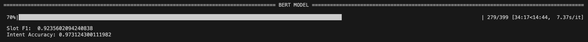

# EXPERIMENTS and RESULTS

## Fine-tune BERT model
- 1st test: `Slot F1:  0.0` - `Intent Accuracy: 0.7077267637178052`
  - TRAIN_BATCH_SIZE = 128
  - VALID_BATCH_SIZE = 64
  - TEST_BATCH_SIZE = 64
  - LEARNING_RATE = 0.1
  - DROPOUT = 0.3
  - CLIP = 5

- 2nd test; `Slot F1:  0.0` - `Intent Accuracy: 0.7077267637178052`
  - TRAIN_BATCH_SIZE = 128
  - VALID_BATCH_SIZE = 64
  - TEST_BATCH_SIZE = 64
  - LEARNING_RATE = 0.01
  - DROPOUT = 0.3
  - CLIP = 5

- 3rd test: `Slot F1:  0.0` - `Intent Accuracy: 0.7077267637178052`
  - TRAIN_BATCH_SIZE = 128
  - VALID_BATCH_SIZE = 64
  - TEST_BATCH_SIZE = 64
  - LEARNING_RATE = 0.001
  - DROPOUT = 0.3
  - CLIP = 5

- 4th test: `Slot F1:  0.0` - `Intent Accuracy: 0.7077267637178052`
  - TRAIN_BATCH_SIZE = 128
  - VALID_BATCH_SIZE = 64
  - TEST_BATCH_SIZE = 64
  - LEARNING_RATE = 0.0005
  - DROPOUT = 0.3
  - CLIP = 5

- 5th test: `Slot F1:  0.0` - `Intent Accuracy: 0.7077267637178052`
  - TRAIN_BATCH_SIZE = 128
  - VALID_BATCH_SIZE = 64
  - TEST_BATCH_SIZE = 64
  - LEARNING_RATE = 0.0001
  - DROPOUT = 0.3
  - CLIP = 5

- 6th test: `Slot F1:  0.9039763847890258` - `Intent Accuracy: 0.9675251959686451`
  - TRAIN_BATCH_SIZE = 128
  - VALID_BATCH_SIZE = 64
  - TEST_BATCH_SIZE = 64
  - LEARNING_RATE = 0.00005
  - DROPOUT = 0.3
  - CLIP = 5

- 7th test: `Slot F1:  0.8899289304905529` - `Intent Accuracy: 0.961926091825308`
  - TRAIN_BATCH_SIZE = 128
  - VALID_BATCH_SIZE = 64
  - TEST_BATCH_SIZE = 64
  - LEARNING_RATE = 0.00001
  - DROPOUT = 0.3
  - CLIP = 5

- 8th test: `Slot F1:  0.8784981748652877` - `Intent Accuracy: 0.9664053751399776`
  - TRAIN_BATCH_SIZE = 128
  - VALID_BATCH_SIZE = 64
  - TEST_BATCH_SIZE = 64
  - LEARNING_RATE = 0.000005
  - DROPOUT = 0.3
  - CLIP = 5

- 9th test: `Slot F1:  0.0` - `Intent Accuracy: 0.7077267637178052`
  - TRAIN_BATCH_SIZE = 128
  - VALID_BATCH_SIZE = 64
  - TEST_BATCH_SIZE = 64
  - LEARNING_RATE = 0.000001
  - DROPOUT = 0.3
  - CLIP = 5

- 10th test: `Slot F1:  0.908646288209607` - `Intent Accuracy: 0.9563269876819709`
  - TRAIN_BATCH_SIZE = 128
  - VALID_BATCH_SIZE = 64
  - TEST_BATCH_SIZE = 64
  - LEARNING_RATE = 0.00005
  - DROPOUT = 0.5
  - CLIP = 5

- 11th test: `Slot F1:  0.9023498694516972` - `Intent Accuracy: 0.961926091825308`
  - TRAIN_BATCH_SIZE = 128
  - VALID_BATCH_SIZE = 64
  - TEST_BATCH_SIZE = 64
  - LEARNING_RATE = 0.00005
  - DROPOUT = 0.05
  - CLIP = 5

- 12th test: `Slot F1:  0.8903919528269164` - `Intent Accuracy: 0.9518477043673013`
  - TRAIN_BATCH_SIZE = 128
  - VALID_BATCH_SIZE = 64
  - TEST_BATCH_SIZE = 64
  - LEARNING_RATE = 0.00005
  - DROPOUT = 0.2
  - CLIP = 5

- 13th test: `Slot F1:  0.9014084507042254` - `Intent Accuracy: 0.9686450167973124`
  - TRAIN_BATCH_SIZE = 128
  - VALID_BATCH_SIZE = 64
  - TEST_BATCH_SIZE = 64
  - LEARNING_RATE = 0.00005
  - DROPOUT = 0.1
  - CLIP = 10

- BEST TEST: `Slot F1:  0.9235602094240838` - `Intent Accuracy: 0.973124300111982` ✅
  - TRAIN_BATCH_SIZE = 128
  - VALID_BATCH_SIZE = 64
  - TEST_BATCH_SIZE = 64
  - LEARNING_RATE = 0.00005
  - DROPOUT = 0.1
  - CLIP = 5

