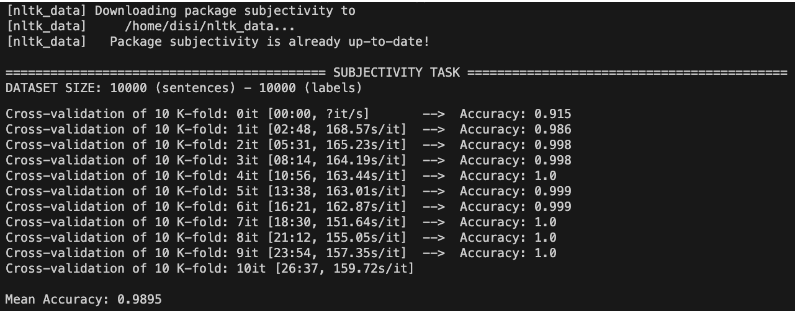
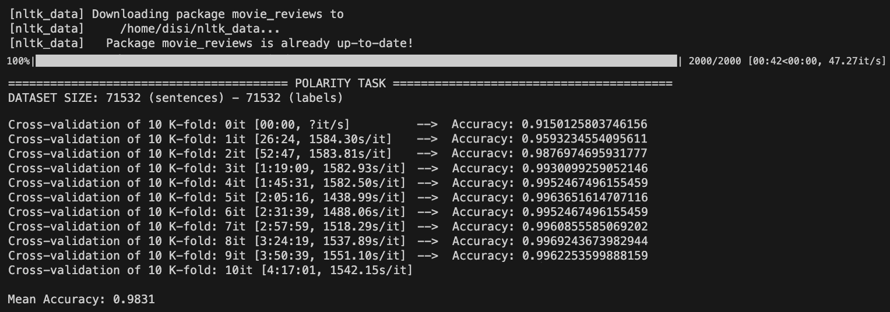
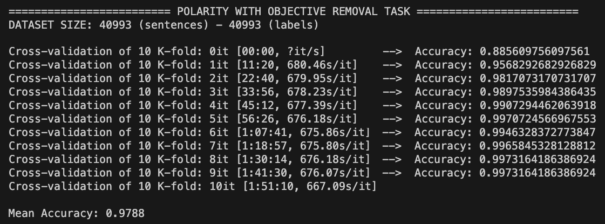

# EXPERIMENTS and RESULTS

## Subjectivity task
- 1st test: `Mean Accuracy: 0.9735`
    - TRAIN_BATCH_SIZE = 128
    - TEST_BATCH_SIZE = 64
    - LEARNING_RATE = 0.0005
    - KFOLD = 5

- 2nd test: `Mean Accuracy: 0.9818`
    - TRAIN_BATCH_SIZE = 128
    - TEST_BATCH_SIZE = 64
    - LEARNING_RATE = 0.0001
    - KFOLD = 5

- 3rd test: `Mean Accuracy: 0.9840`
    - TRAIN_BATCH_SIZE = 128
    - TEST_BATCH_SIZE = 64
    - LEARNING_RATE = 0.00005
    - KFOLD = 5

- 4th test: `Mean Accuracy: 0.9799`
    - TRAIN_BATCH_SIZE = 128
    - TEST_BATCH_SIZE = 64
    - LEARNING_RATE = 0.00001
    - KFOLD = 5

- 5th test: `Mean Accuracy: 0.9673`
    - TRAIN_BATCH_SIZE = 128
    - TEST_BATCH_SIZE = 64
    - LEARNING_RATE = 0.000005
    - KFOLD = 5

- 6th test: `Mean Accuracy: 0.9841`
    - TRAIN_BATCH_SIZE = 64
    - TEST_BATCH_SIZE = 64
    - LEARNING_RATE = 0.00005
    - KFOLD = 5

- 7th test: `Mean Accuracy: 0.9821`
    - TRAIN_BATCH_SIZE = 32
    - TEST_BATCH_SIZE = 64
    - LEARNING_RATE = 0.00005
    - KFOLD = 5

- 8th test: `Mean Accuracy: 0.9818`
    - TRAIN_BATCH_SIZE = 64
    - TEST_BATCH_SIZE = 32
    - LEARNING_RATE = 0.00005
    - KFOLD = 5

- BEST TEST: `Mean Accuracy: 0.9895` ✅
    - TRAIN_BATCH_SIZE = 64
    - TEST_BATCH_SIZE = 64
    - LEARNING_RATE = 0.00005
    - KFOLD = 10

## Polarity task
- 1st test: `Mean Accuracy: 0.9663`
    - TRAIN_BATCH_SIZE = 64
    - TEST_BATCH_SIZE = 64
    - LEARNING_RATE = 0.0001
    - KFOLD = 5

- 2nd test: `Mean Accuracy: 0.9701`
    - TRAIN_BATCH_SIZE = 64
    - TEST_BATCH_SIZE = 64
    - LEARNING_RATE = 0.00005
    - KFOLD = 5

- BEST TEST: `Mean Accuracy: 0.9831` ✅
    - TRAIN_BATCH_SIZE = 64
    - TEST_BATCH_SIZE = 64
    - LEARNING_RATE = 0.00005
    - KFOLD = 10

## Polarity with objective removal task
- 1st test: `Mean Accuracy: 0.9602`
    - TRAIN_BATCH_SIZE = 64
    - TEST_BATCH_SIZE = 64
    - LEARNING_RATE = 0.0001
    - KFOLD = 5

- 2nd test: `Mean Accuracy: 0.9609`
    - TRAIN_BATCH_SIZE = 64
    - TEST_BATCH_SIZE = 64
    - LEARNING_RATE = 0.00005
    - KFOLD = 5

- 3rd test: `Mean Accuracy: 0.9561`
    - TRAIN_BATCH_SIZE = 64
    - TEST_BATCH_SIZE = 64
    - LEARNING_RATE = 0.00001
    - KFOLD = 5

- BEST TEST: `Mean Accuracy: 0.9788` ✅
    - TRAIN_BATCH_SIZE = 64
    - TEST_BATCH_SIZE = 64
    - LEARNING_RATE = 0.00005
    - KFOLD = 10

