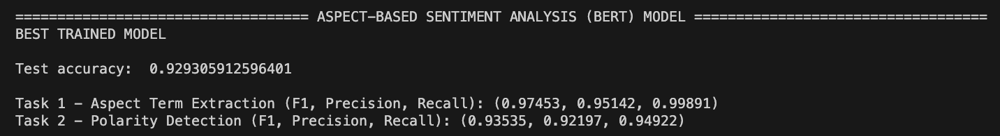

# EXPERIMENTS and RESULTS

## Aspect Term Extraction & Polarity Detection
- 1st test: 
    - TRAIN_BATCH_SIZE = 256
    - TEST_BATCH_SIZE = 256
    - LEARNING_RATE = 0.00005

```bash
Task 1 - Aspect Term Extraction (F1, Precision, Recall): (0.90189, 0.88605, 0.91833)
Task 2 - Polarity Detection (F1, Precision, Recall): (0.88288, 0.87350, 0.89252)
```

- 2nd test:
    - TRAIN_BATCH_SIZE = 512
    - TEST_BATCH_SIZE = 512
    - LEARNING_RATE = 0.00005

```bash
Task 1 - Aspect Term Extraction (F1, Precision, Recall): (0.93071, 0.91221, 0.95004)
Task 2 - Polarity Detection (F1, Precision, Recall): (0.89728, 0.89276, 0.90189)
```

- 3rd test:
    - TRAIN_BATCH_SIZE = 1024
    - TEST_BATCH_SIZE = 1024
    - LEARNING_RATE = 0.0001

```bash
Task 1 - Aspect Term Extraction (F1, Precision, Recall): (0.96012, 0.93187, 0.99020)
Task 2 - Polarity Detection (F1, Precision, Recall): (0.92860, 0.91550, 0.94213)
```

- BEST TEST: ✅
    - TRAIN_BATCH_SIZE = 1024
    - TEST_BATCH_SIZE = 1024
    - LEARNING_RATE = 0.00005

```bash
Task 1 - Aspect Term Extraction (F1, Precision, Recall): (0.97453, 0.95142, 0.99891)
Task 2 - Polarity Detection (F1, Precision, Recall): (0.93535, 0.92197, 0.94922)
```

