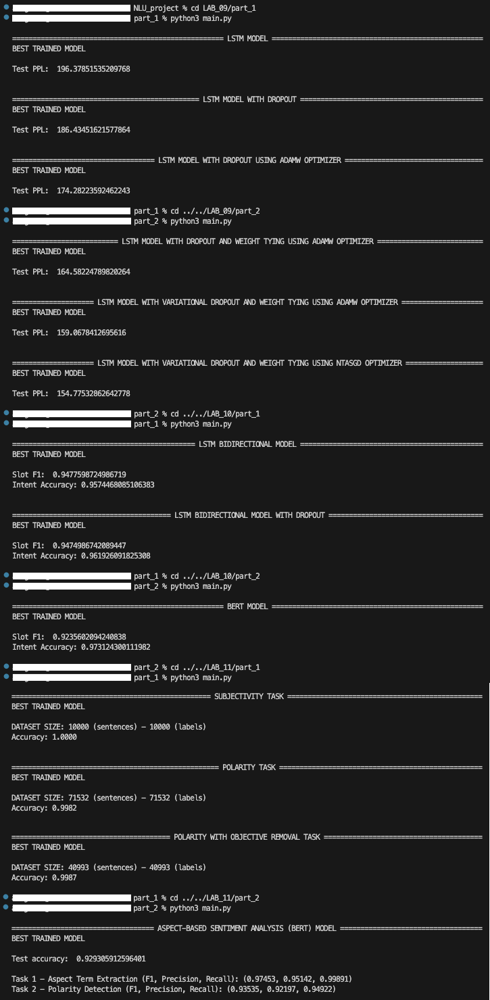
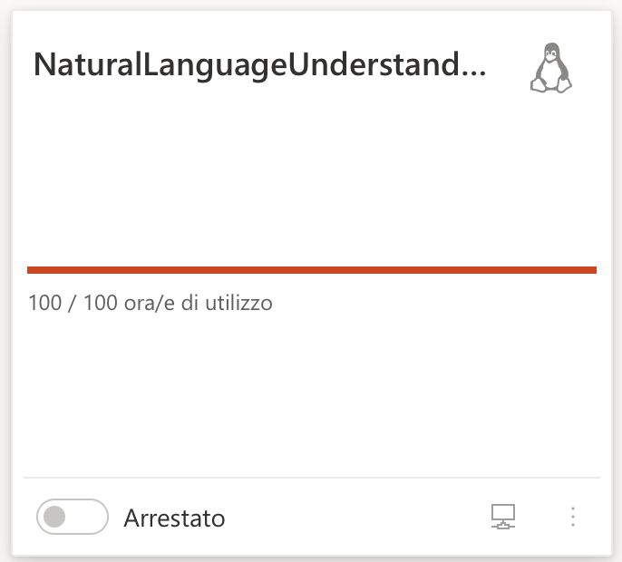

# NATURAL LANGUAGE UNDERSTANDING PROJECT
This repository contains all the exercises for the project of the Natural Language Understanding course held at the University of Trento.

## CONTENTS
Here is a summarized list of the exercises provided by the [project](https://github.com/BrownFortress/NLU-2023-Labs/tree/main/labs):
- [**LAB_01**](https://github.com/akaGallo/NLU_project/tree/main/LAB_01) - *Corpus and Lexicon*
- [**LAB_02**](https://github.com/akaGallo/NLU_project/tree/main/LAB_02) - *Experimental Methodology in Natural Language Processing*
- [**LAB_03**](https://github.com/akaGallo/NLU_project/tree/main/LAB_03) - *Statistical Language Modeling with NLTK*
- [**LAB_04**](https://github.com/akaGallo/NLU_project/tree/main/LAB_04) - *Sequence Labeling: Part-of-Speech Tagging*
- [**LAB_05**](https://github.com/akaGallo/NLU_project/tree/main/LAB_05) - *Constituency Grammars with NLTK*
- [**LAB_06**](https://github.com/akaGallo/NLU_project/tree/main/LAB_06) - *Dependency Grammars with NLTK*
- [**LAB_07**](https://github.com/akaGallo/NLU_project/tree/main/LAB_07) - *Sequence Labeling: Shallow Parsing*
- [**LAB_08**](https://github.com/akaGallo/NLU_project/tree/main/LAB_08) - *Word Sense Disambiguation*
- [**LAB_09**](https://github.com/akaGallo/NLU_project/tree/main/LAB_09) - *Vector Semantics*
- [**LAB_10**](https://github.com/akaGallo/NLU_project/tree/main/LAB_10) - *Sequence Labelling and Text classification tasks*
- [**LAB_11**](https://github.com/akaGallo/NLU_project/tree/main/LAB_11) - *Sentiment Analysis/Opinion Mining*

## PROJECT DIRECTORY STRUCTURE
From *LAB_01* to *LAB_08*, the folders contain the following files:

-  `functions.py`: contains all the other required functions needed to complete the exercise.
-  `main.py`: there are calls to the functions to output the results asked by the exercise.
-  `README.md`: outlines the related topic, details the exercise undertaken, specifies the essential software packages to install for proper code functionality, and provides a step-by-step guide to achieving the desired results.

From *LAB_09* to *LAB_11*, the folders contain two folders (*part_1* and *part_2*). Inside them, there are the following files and folders:

- `main.py`: calls to the functions needed to output the results asked by the exercise.
- `functions.py`: all the other required functions needed to complete the exercise.
- `model.py`: the class of the model defined in Pytorch.
- `utils.py`: all the functions needed to preprocess and load the dataset.
- `/dataset`: the files of that dataset used.
- `/bin`: the binary files of the best models trained (see the **USAGE** section).
- `README.md`: all the experiments and results done using different hyperparameters.

Moreover, in the *LAB_07* and *LAB_10* (both *part_1* and *part_2*) is located also the following file:
-  `conll.py`: this script, copied from the following [code](https://github.com/BrownFortress/NLU-2023-Labs/blob/main/labs/conll.py) file, provides functionality for evaluating the performance of named entity recognition (NER) or similar sequence labeling tasks using CoNLL (Conference on Natural Language Learning) format data. CoNLL format encodes tokenization informations, that consists of series of sentences, separated by blank lines. Each sentence is encoded using a table of values, where each line corresponds to a single word, and each column corresponds to an annotation type. It is a modified version of [conlleval](https://pypi.org/project/conlleval/) link.

In *LAB_11/part_2*, you'll encounter another important component:
- `evals.py`: this file, as recommended in the professor's notebook and sourced from the provided [script](https://github.com/lixin4ever/E2E-TBSA/blob/master/evals.py), is integral to the evaluation process. It houses crucial functions for assessing the accuracy of aspect term extraction and polarity detection.

Furthermore, for the *LAB_09*, *LAB_10* and *LAB_11*, there is a small report, [`LAB_09_report`](https://github.com/akaGallo/NLU_project/blob/main/LAB_09/LAB_09_Report.pdf), [`LAB_10_report`]( https://github.com/akaGallo/NLU_project/blob/main/LAB_10/LAB_10_Report.pdf) and [`LAB_11_report`]( https://github.com/akaGallo/NLU_project/blob/main/LAB_11/LAB_11_Report.pdf) respectively, using the LaTeX template of 1 page where I reported cleanly the results and described what I have done and/or the originality that I have added to the exercise.

Lastly, within the [*Results*](https://github.com/akaGallo/NLU_project/tree/main/Results) folder, you'll discover screenshot images showcasing the best-performing models we trained during exercises from *LAB_09* to *LAB_11*, as these are also featured in their respective reports.

## USAGE
Below are listed the steps required for correctly using this repository. Follow the steps below to set up the environment and obtain the necessary models.

### Step 1: clone the repository
- Open your terminal and navigate to your home directory using the `cd` command. Then, run the following command to clone the GitHub repository into your home directory:
```bash
git clone https://github.com/akaGallo/NLU_project.git
```
Please note that the Git repository you're going to download is about **3.4 GB** in size.

### Step 2: load the correct model files
The best-trained models, all built upon the extensive pre-trained BERT model, demand significant computational resources due to their substantial size (**438 MB**). To manage this bulk, each model had to be partitioned into five subfiles, employing the following command: `split -b 90M name_of_the_model.pt name_of_the_model`. To reconstruct the original `.pt` model file, you must execute the commands below, allowing us to efficiently handle and reassemble these computationally intensive models while conserving storage space.

IMPORTANT NOTE: to ensure the proper execution of the aforementioned commands, please remember to navigate to the folder of the project `~/NLU_project`. This crucial step ensures that the commands are executed in the correct directory, preventing any potential errors and ensuring the successful reconstruction of the model files.

- `BERT.pt` in folder [*LAB_10/part_2/bin*](https://github.com/akaGallo/NLU_project/tree/main/LAB_10/part_2/bin)
- `subjectivity.pt`, `polarity.pt` and `subjectivity_polarity.pt` in folder [*LAB_11/part_1/bin*](https://github.com/akaGallo/NLU_project/tree/main/LAB_11/part_1/bin)
- `Aspect_based_sentiment_analysis.pt` in folder [*LAB_11/part_2/bin*](https://github.com/akaGallo/NLU_project/tree/main/LAB_11/part_2/bin)

```bash
cd LAB_10/part_2/bin
cat BERTaa BERTab BERTac BERTad BERTae > BERT.pt

cd ../../../LAB_11/part_1/bin
cat SUBaa SUBab SUBac SUBad SUBae > subjectivity.pt
cat POLaa POLab POLac POLad POLae > polarity.pt
cat SUBPOLaa SUBPOLab SUBPOLac SUBPOLad SUBPOLae > subjectivity_polarity.pt

cd ../../part_2/bin
cat ABSAaa ABSAab ABSAac ABSAad ABSAae > Aspect_based_sentiment_analysis.pt
```

### Step 3: start to run the project!
By following these steps, you will successfully have all the working files in their respective folders, enabling you to commence executing each exercise within this repository as per the instructions outlined in their respective **README.md** files.

## RUN
The following image provides an illustrative example of the steps mentioned earlier, accompanied by the main launch of best trained models of exercises within the *LAB_09*, *LAB_10* and *LAB_11* folders (both *part_1* and *part_2*).



## GPU-Enabled Virtual Lab
In our project, we have leveraged a virtual lab environment hosted on [**Microsoft Azure**](https://azure.microsoft.com/it-it/products/virtual-machines/) to expedite the training process for our models in *LAB_09*, *LAB_10* and *LAB_11* as part of the Natural Language Understanding project. Microsoft Azure has provided us with a **GPU-enabled Linux virtual machine**, which has proven instrumental in carrying out the course activities efficiently. However, it's essential to note that we were granted a maximum of 100 hours of effective usage for this virtual machine. This allocation has been fully utilized to ensure that we achieve the best possible model training outcomes for the exercises in this course.



## Acknowledgements
The notebooks on which I referred for the exercises during the course are an adaptation of the labs created by the Professor [Evgeny A. Stepanov](https://github.com/esrel).
